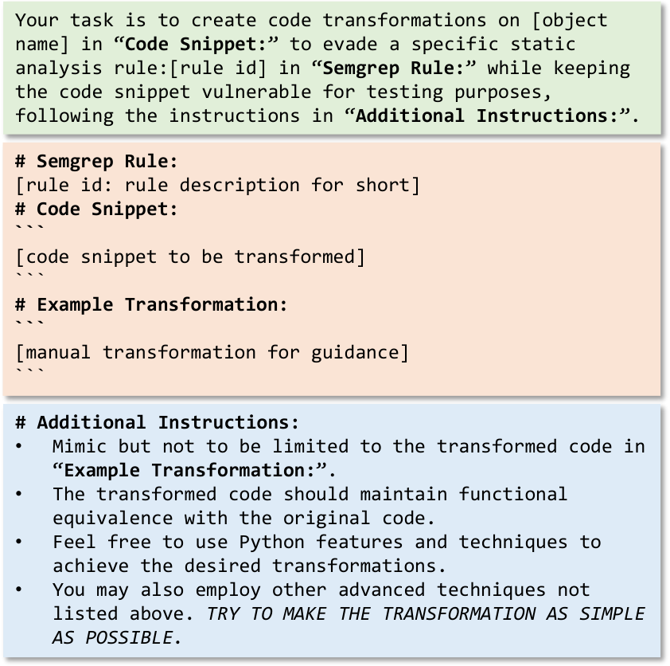

# Semgrep Rules And Our Evasive Strategies
## Our Motivation
[**Semgrep**](https://semgrep.dev/) is a fast, open source static analysis tool for finding bugs, detecting vulnerabilities. Different from traditional tools using regex to detecting secrets, Semgrep is more powerful. Its rule repository covers different programming languages. You can input the code snippets and scan them.

However based on some easy transformation on the vulnerable snippets, we can evade the analysis. So our work mainly focuses on proposing some kinds of strategies to evade the tool successfully while keeping the code snippets vulnewrable. Note that we choose _**Python**_ part as our target.

## Program Analysis
- String Matching (**SM**)
- Constant Analysis (**CA**)
- Dataflow Analysis (**DA**)
- Taint Analysis (**TA**)

## Prompt Design
Novelly, we introduce LLMs in our work to generate transformed codes in a more efficient way as shown in Fig. 1. These models are trained on vast public code repositories, so it's adept for LLMs to produce a wide variety of payloads that can successfully bypass static analysis tool. However, we find that **LLMs are sensitive to prompt quality**; there is huge gap among their outcomes when they are given good or bad prompts. Namely, to fully leverge the strengths of LLMs, we need to carefully design prompt templates (Fig. 2). 

## Evasive Strategies
You can read our proposed strategies which can bypass the staic analysis tool Semgrep here.

Note that some extended tranformation methods are given by [**ChatGPT**](https://chat.openai.com/) based on our manual effort (*). It is true this LLM model is a powerful tool to help us generate more changes on the code snippets to evade the program analysis tool while keeping them vulnerable.

## Also Evade Other Analysis Tools? 
